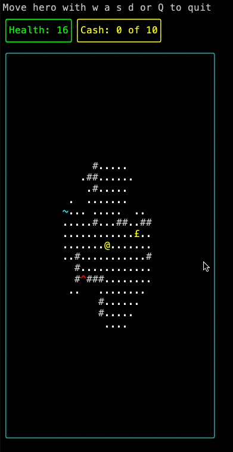
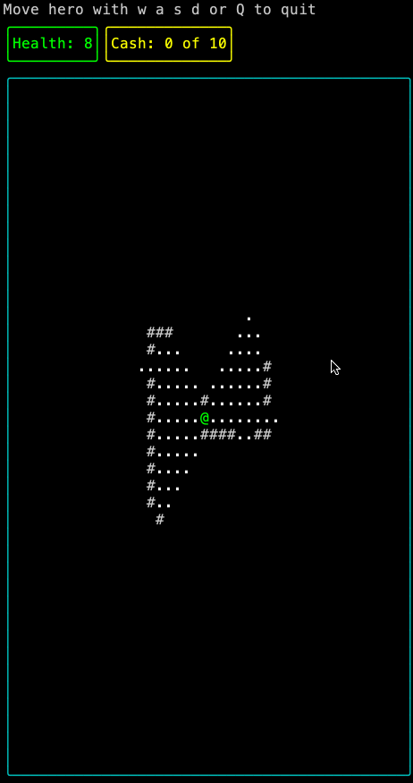

# Krogue

Kotlin Roguelike with Kotter

Procedural generated world with Field Of View camera

[Roguelike](https://en.wikipedia.org/wiki/Roguelike) sample using [Kotter](https://github.com/varabyte/kotter) terminal library

`./gradlew run`

Press Q (shift-q) to quit terminal

---

## Raycasting

## Shadowcasting

---

## Todo

- [ ] Add Health Points to Hero
- [ ] Add Time Limit
- [ ] Hero takes damage from water and lava
- [ ] Find Treasure before running out of health and time

---

## References

[roguelikes](https://jeremyceri.se/roguelikes/)

[FOV using recursive shadowcasting](http://roguebasin.com/index.php/FOV_using_recursive_shadowcasting)

[ironwood](https://github.com/pushcx/ironwood/)
